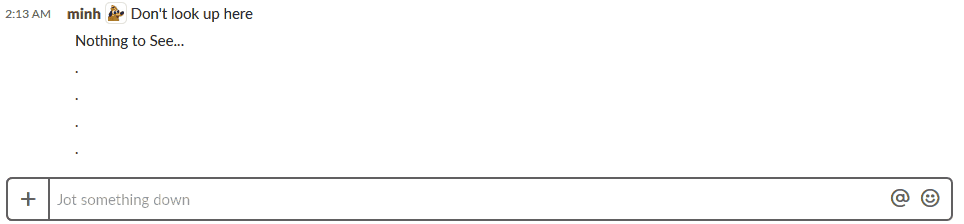

# SLAPS


## Slack-based Local Admin Password Solution

LAPS is a great tool for securing client computers, but it can get annoying when you don't have easy access on-the-go. Get your client computer's local admin password through Slack!



## Getting Started
Install Local Administrator Password Solution (LAPS) from Microsoft and make sure to install the Powershell module!

Open Powershell in Admin Mode and run `Set-ExecutionPolicy unrestricted`

Then run setup.ps1 (admin mode not required or preferred).


## .env should look like this
```
SECRET_KEY= django secret
SLACK_SIGNING_SECRET= slack secret

POWERSHELLPATH= path to powershell executable
POWERSHELLCMD= path to the laps powershell script

AD_USER= domain\user of an AD user with LAPS read privileges
AD_PASSWORD= password of that user

ALLOWED_HOST= hostname
ALLOWED_SLACK_CHANNELS= put a comma separate list of channel IDs here that can have access. such as {GS2FD231Y,DFKJXSU38} without the brackets.
```

## Speedup Powershell
If Powershell is too slow, ngen can greatly decreased startup time. Requires admin rights.
```
Set-Alias ngen (Join-Path ([Runtime.InteropServices.RuntimeEnvironment]::GetRuntimeDirectory()) ngen.exe)
ngen update
```
